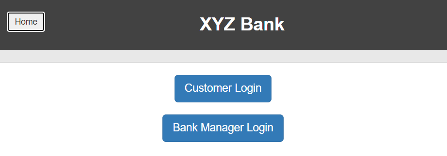

# DemoAutomation Bank

Welcome to DemoAutomation Bank, an exemplary online banking application meticulously designed for testing and automation purposes. This project emulates a real-world banking system, offering essential functionalities such as user registration, secure login, account management, fund transfers, and transaction history.

#### For a live preview, visit the [DemoAutomation Bank Website](https://www.globalsqa.com/angularJs-protractor/BankingProject/#/login)

## Key Features

- **Add Customer:** Seamlessly create new accounts with personal information and chosen credentials.
- **Login:** Securely access accounts with registered credentials.
- **Account Management:** View and manage accounts, update personal details, and modify passwords.
- **Fund Transfers:** Effortlessly transfer funds between accounts or to other registered users.
- **Transaction History:** Detailed records of transactions, including dates, amounts, and types.

## Testing and Automation Excellence

Explore advanced testing techniques and tools with DemoAutomation Bank:

- **Manual Testing:** Rigorous verification of functionality, security, and usability through meticulously crafted test cases.
- **Automated Testing:** Utilize industry-standard frameworks like Selenium and TestNG for robust test automation.
- **Page Object Design Pattern:** Maintain a modular and scalable test automation framework with the Page Object design pattern.
- **Java Environment:** Developed using Java, seamlessly integrates with popular IDEs such as Eclipse for coding and debugging.
- **CI/CD Integration:** Set up Continuous Integration and Continuous Deployment (CI/CD) pipelines with Jenkins for streamlined development processes.
- **Maven Build Management:** Efficiently manage project dependencies, generate test reports, and facilitate integration with external libraries or frameworks.

## Getting Started

To leverage DemoAutomation Bank for testing and automation:

1. Clone the repository to your local development environment.
2. Set up dependencies and libraries using Maven.
3. Configure the project in your preferred IDE (e.g., Eclipse) for development and debugging.
4. Execute manual tests to validate basic functionality.
5. Develop robust automated test scripts with Selenium and TestNG.
6. Integrate the project with CI/CD tools like Jenkins for automated build, test, and deployment processes.

## Contributions

Contributions to DemoAutomation Bank are encouraged! Report issues or submit pull requests on the [GitHub repository](insert_repository_link). Please adhere to existing coding standards and testing practices.

## License

This project is licensed under the [MIT License](https://opensource.org/licenses/MIT). Feel free to use, modify, and distribute it according to the terms of the license.

## Disclaimer

DemoAutomation Bank is a fictional online banking application designed exclusively for testing and automation purposes. It does not involve real financial transactions or store sensitive user information. Treat this project as a simulation, refraining from using it for actual banking operations.
